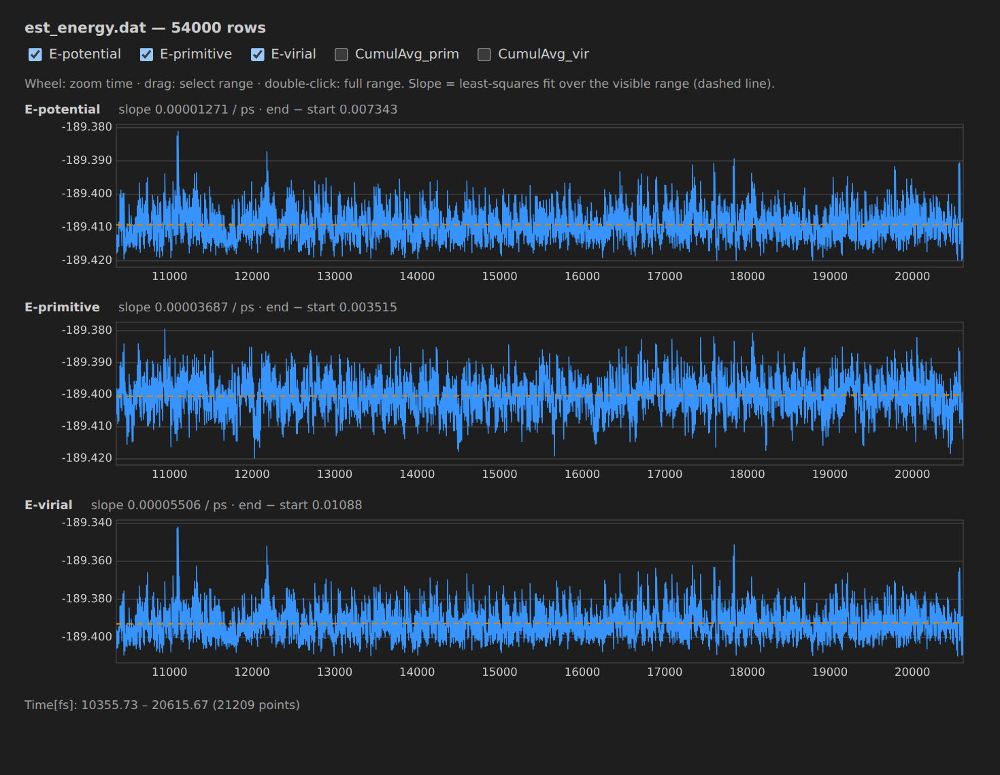
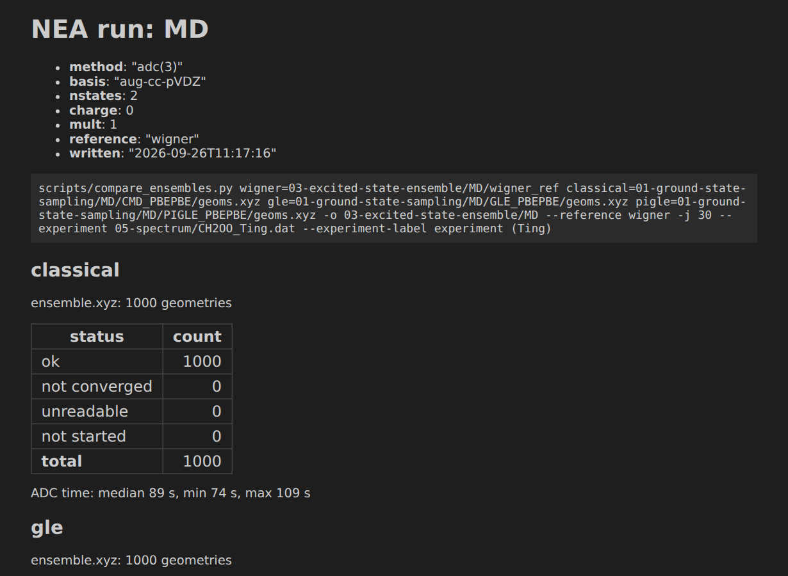
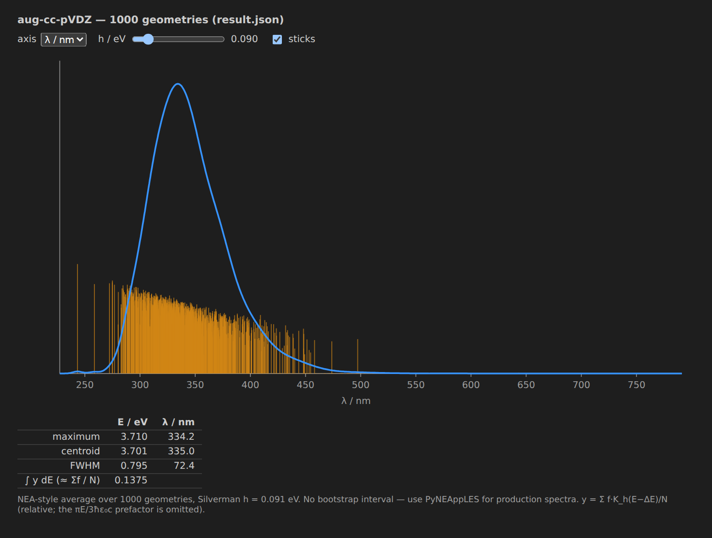

# Orbital — ORCA in VS Code

VS Code extension for [ORCA](https://orcaforum.kofo.mpg.de/) inputs and outputs, plus helpers for the
NEA UV/Vis workflow of [uv-vis](https://github.com/alestoman5/uv-vis) (sampling with
[ABIN](https://github.com/PHOTOX/ABIN) or [SHARC](https://sharc-md.org/) `wigner.py`, spectra with
[PyNEAppLES](https://github.com/stepan-srsen/PyNEAppLES)).

## Install

```bash
npm install && npx vsce package
code --install-extension orca-inp-0.2.0.vsix
```

## How to use

**`.inp` files** — highlighting, completion, hover and live checks (unclosed blocks, charge/multiplicity,
unknown keywords) as you type. Snippets: type `orca-` and pick one.


**`.out` files** — the status bar shows the verdict of the active run (running, failed, saddle point, minimum);
click it for actions: displace along an imaginary mode, IRC input, Molden export for SHARC `wigner.py`,
Wigner readiness report.


**ORCA Runs** (Explorer) — optimizations (`Opt`/`OptTS`) among the `.out` files in the folder of the active
file, with imaginary modes and convergence problems flagged.

**MD data** — right-click an ABIN `.dat` (`energies.dat`, `est_energy.dat`, `temper.dat`) →
*Plot MD Data*. Wheel or drag to zoom, double-click to reset; each column shows the least-squares slope and
end − start over the visible range.



**NEA runs (uv-vis `scripts/`)** — right-click a working directory (`runs/<name>/`):

- *NEA Run Overview* — ok / not converged / unreadable / not started geometries, with links to `run.log`
- *Preview Absorption Spectrum* — quick spectrum from `geom_*/result.json` (or ORCA `.out`)
- *Open NEA Run Outputs* — `spectrum.png`, `summary.txt`, `pipeline.log`, …
- *Build NEA Script Command* — assembles `from_geometry.py` / `from_ensemble.py` / `compare_ensembles.py`
  and types it into a terminal without running it




Other folder commands: basis-set variants, geometry comparison, PyNEAppLES export, Boltzmann weights.
Settings: `orcaInp.*` in the Settings UI.

## AI disclosure

Written with [Claude Code](https://claude.com/claude-code) (Anthropic, Claude Opus 5); the author is responsible
for the code.

## License

MIT — see [LICENSE](./LICENSE).
