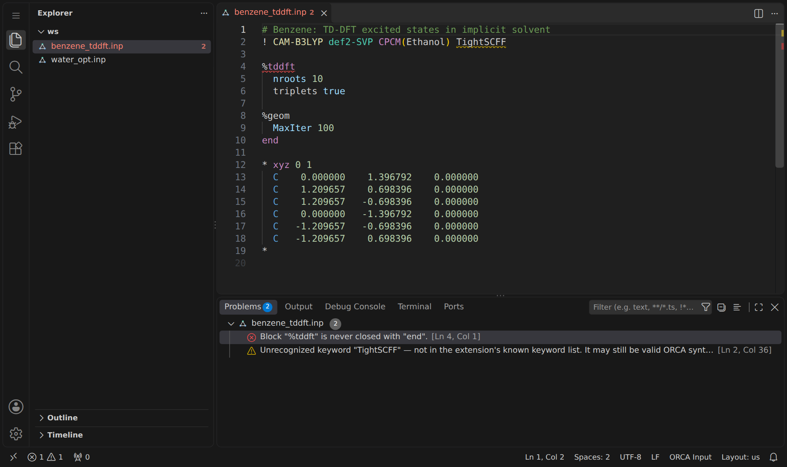
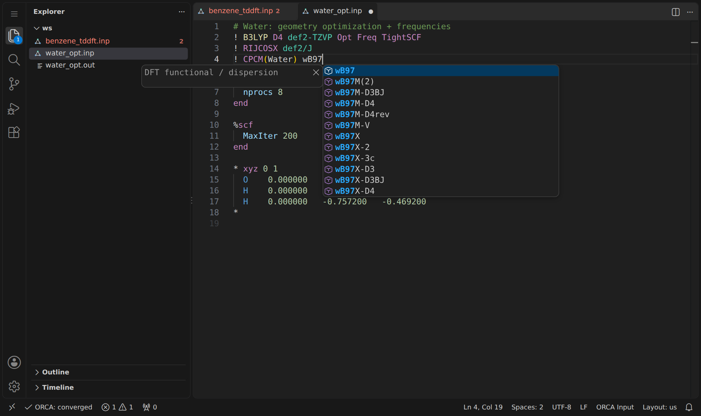
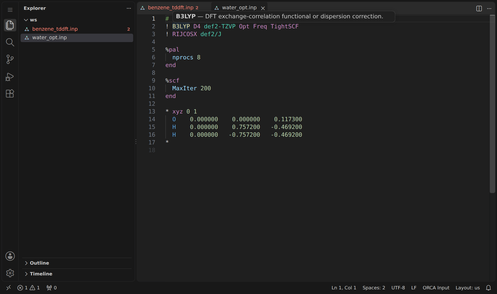
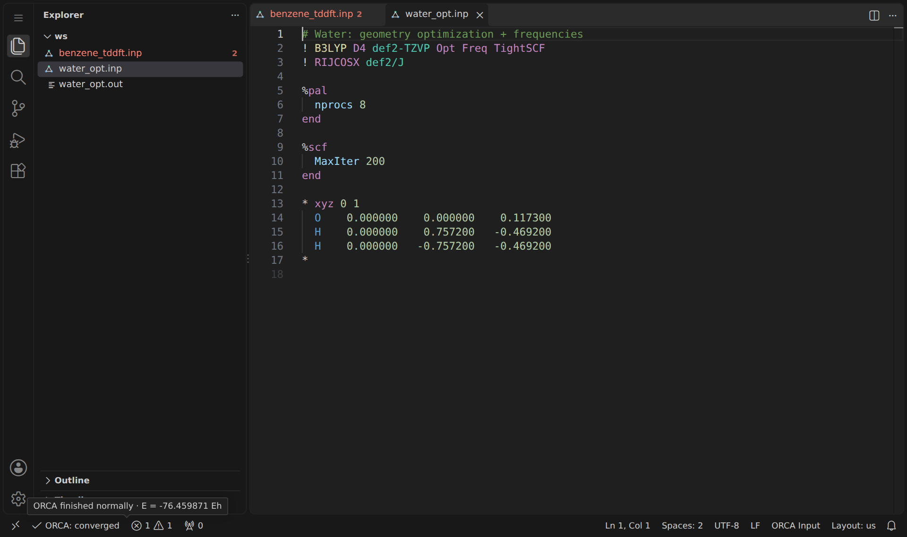

# ORCA Input (.inp) — VS Code extension

Syntax highlighting, structural diagnostics, and autocompletion for
[ORCA](https://orcaforum.kofo.mpg.de/) quantum-chemistry `.inp` input files.



## Features

- **Syntax highlighting** for simple-input lines (`! B3LYP def2-TZVP D4`),
  `%block ... end` regions, coordinate blocks (`* xyz 0 1 ... *`), comments,
  numbers and strings.
- **Diagnostics** (updates live as you type):
  - unclosed `%block` (missing `end`)
  - stray `end` with no matching `%block`
  - unclosed coordinate block (`*` opened but never closed)
  - malformed coordinate block header (missing charge/multiplicity)
  - unrecognized simple-input keywords (configurable severity)
  - missing simple-input line / missing coordinate block (info hints)
- **Autocompletion**:
  - method/functional and basis-set names after `!`
  - block names after `%`
  - inside a `%block ... end` region, that block's own options with a short
    description (`%geom`, `%scf`, `%tddft`/`%cis`, `%cpcm`, `%freq`, `%irc`,
    `%neb`, `%mdci`, `%casscf`, `%eprnmr`, `%output`, `%pal`, `%md`); other
    blocks get a generic list
  - coordinate block types (`xyz`, `xyzfile`, `int`, `gzmt`) after `*`
- **Chemistry-aware diagnostics** (`orcaInp.diagnostics.semantic`):
  charge/multiplicity parity (inline atoms or a readable `xyzfile`), atom
  order against `orcaInp.referenceAtomOrder`, several job types on the `!`
  line, `OptTS` without a starting Hessian, `Freq` on a non-optimized
  inline geometry, `%tddft` without `NRoots`, several orbital basis sets,
  and (opt-in) `%maxcore × nprocs` vs. this machine's memory.
- **Snippets**: `orca-sp`, `orca-optfreq`, `orca-optfreq-tight`,
  `orca-tddft`, `orca-optts`, `orca-irc`, `orca-nebts`, `orca-scan`,
  `orca-goat`, `orca-engrad`, `orca-eom-ccsd`, `orca-steom`, `orca-dlpno`,
  `orca-moread`, `orca-pal`, `orca-constraints`, `orca-cpcm` (type the
  prefix in a `.inp` file and hit Tab/Enter).
- **Hover**: hovering a recognized simple-input keyword, a `%block` name or
  a block option shows a short description. In `.out` files, hovering a
  number with an energy unit (`Eh`, `eV`, `nm`, `cm**-1`, `kcal/mol`,
  `kJ/mol`) shows it converted to the other units.
- **`.out` run status**: while an `.inp` (or `.out`) file is active, a status
  bar item tracks its output (`job.out` or `job.inp.out`) and reads the
  verdict from the log itself: running, failed (abort, SCF or optimizer
  not converged), **saddle point** (imaginary modes after `Opt`), TS with the
  right/wrong number of imaginary modes, or minimum. T1/D1 diagnostics
  above 0.02/0.05 are flagged. Click it for the actions that fit the run.

### Frequencies, saddle points and Wigner sampling

- **Saddle point → displaced restart.** When an optimization finishes with
  an imaginary mode, a notification offers to displace the geometry along
  the most negative mode (default: the atom that moves most moves 0.15 Å,
  `orcaInp.ts.maxDisplacement`) in `+` or both directions. It writes
  `job_disp.xyz` + `job_disp.inp`, a copy of the input with only the
  coordinate block replaced by `* xyzfile`. Modes come from `job.hess` (or
  the `.out` NORMAL MODES). Frequencies above `orcaInp.ts.imagThreshold`
  (−20 cm⁻¹) count as numerical noise.
- **TS → IRC.** After an `OptTS` + `Freq` with exactly one imaginary mode,
  a new `job_irc.inp` reuses the TS geometry and Hessian
  (`%irc InitHess read, Hess_Filename "job.hess"`).
- **Export Molden (normal modes)** writes the layout SHARC's `ORCA_freq.py`
  produces and `wigner.py` reads. From a `.out`, the output is identical,
  line for line, to `ORCA_freq.py`'s (checked on a 24-atom Opt+Freq run).
  Saddle points are refused unless you insist.
- **Wigner readiness report**: normal termination, no imaginary modes,
  3N−6 (3N−5) modes, soft modes below 200 cm⁻¹ that may be anharmonic, and
  per mode the ratio of quantum (Wigner) to classical position variance,
  x·coth x with x = ħω/2kT.

### Working with many runs

- **ORCA Runs view** (Explorer): every `.out` in the workspace with its
  verdict, energy and problems; a filter shows only problem runs. It reads
  the log, not exit codes.
- **Basis-set variants**: copies an `.inp` into one folder per basis set
  (default aug-cc-pVDZ, def2-SVPD, ma-def2-SVP, def2-SVP), optionally with
  a `VeryTightOpt`/`VeryTightSCF` twin, and copies the `xyzfile` along.
- **Compare final geometries**: bonds, angles and dihedrals (e.g.
  `O-O: 2-3`, `C-O-O: 1-2-3`, from `.orca-watch.json` or
  `orcaInp.watchedCoordinates`) across all outputs in a folder, as a
  table and `geometry_comparison.csv`.
- **Export for PyNEAppLES**: reads the electric-dipole absorption table of
  every per-geometry output, skips unfinished/empty runs or runs with the
  wrong number of states (and says why), and writes the
  `calc_spectrum_v2.py` input (energy in eV, transition dipole in au, with
  |μ| taken from the 9-decimal fosc). It then prints the command line with
  the right `-n`.
- **Spectrum preview**: stick spectrum plus Gaussian broadening for one
  output, or an NEA-style average (Silverman bandwidth) over a folder,
  with maximum, centroid, FWHM and integral, in eV or nm. This is a quick
  look only: PyNEAppLES remains the tool for bootstrap intervals.
- **Boltzmann weights** of conformers from `Final Gibbs free energy`
  (select several `.out` files in the Explorer).

## Screenshots

**Autocompletion** — methods, functionals and basis sets after `!`, with a
short description of the selected entry:



**Hover** — a one-line description of recognized keywords and `%block`
names:



**`.out` run status** — the status bar tracks the matching `.out` file; the
tooltip shows the final single-point energy:



## Keyword coverage

`src/keywords.ts` is compiled from the official ORCA manual's
["General Structure of the Input File"](https://www.faccts.de/docs/orca/6.1/manual/contents/essentialelements/input.html)
chapter and currently recognizes **~610 literal simple-input keywords**
(runtypes, HF/MP2/CC/CASSCF/MRCI/DLPNO/AUTOCI/semiempirical methods, the
full DFT functional zoo, basis sets, auxiliary basis sets, ECPs,
relativistic/SOC options, SCF/convergence/output switches) plus **~20
regex patterns** for the parametrized families the manual documents via
placeholders (`cc-pV{D,T,Q,5,6}Z[-DK|-PP|-F12...]`, `DKH-`/`ZORA-`/`ma-`
prefixed basis sets, `PAL<n>`, `CPCM(solvent)`, `Extrapolate(...)`, etc.),
and the **complete list of 35 `%block` names**.

This is *not* literally every keyword ORCA has — the full manual runs
past a thousand pages and documents thousands of block-internal
variables (inside `%scf`, `%tddft`, `%mdci`, `%casscf`, ...) that aren't
practical to enumerate or keep in sync by hand. What's covered
comprehensively is the "simple input" line (everything after `!`),
since that's a closed, well-documented list and the part people type —
and mistype — the most. Block *contents* get curated per-block options
for the everyday blocks (`BLOCK_OPTIONS_BY_BLOCK` in `keywords.ts`) plus a
generic fallback list (`BLOCK_OPTIONS`). They are never flagged as
unknown, to avoid false positives.

## Installation

This extension isn't on the VS Code Marketplace yet, so install it from a
`.vsix` package:

1. Download the `.vsix` file (or build one — see below).
2. In VS Code, open the Extensions view → "..." menu → **Install from VSIX**,
   and pick the file. Or from a terminal:
   ```bash
   code --install-extension orca-inp-0.1.0.vsix
   ```

Once installed, opening any `.inp` file automatically enables syntax
highlighting, diagnostics, autocompletion, snippets, and hover info — no
extra setup needed.

### Building the `.vsix` yourself

```bash
npm install
npm install -g @vscode/vsce
vsce package
```

This produces `orca-inp-0.1.0.vsix` in the project folder, ready to install
as described above.

## Settings

To turn off the "unrecognized keyword" diagnostic, add this to your VS Code
settings:

```json
"orcaInp.diagnostics.unknownKeywordSeverity": "off"
```

Other settings (all under `orcaInp.`, see the Settings UI for details):
`diagnostics.semantic`, `diagnostics.memoryCheck`, `referenceAtomOrder`,
`ts.autoPrompt`, `ts.maxDisplacement`, `ts.imagThreshold`, `ts.useMoread`,
`wigner.temperature`, `wigner.softModeThreshold`, `variants.basisSets`,
`watchedCoordinates`, `pyneapples.pattern`,
`spectrum.singleGeometryBandwidth`, `boltzmann.temperature`,
`runs.exclude`, `runs.maxFiles`.

For a project with a fixed atom order it helps to put this in the
workspace's `.vscode/settings.json`:

```json
"orcaInp.referenceAtomOrder": "C O O H H",
"orcaInp.watchedCoordinates": ["O-O: 2-3", "C-O: 1-2", "C-O-O: 1-2-3"]
```

## Known limitations

- Nested `%block` regions (e.g. `%geom ... Constraints ... end ... end`) are
  handled correctly by the diagnostics (unclosed/stray `end` checks), but
  syntax *highlighting* treats the first `end` it meets as the block close,
  so nested blocks can highlight a little oddly.
- `.out` parsing covers termination status, final energy, SCF/optimizer
  convergence banners, geometry-optimization cycles, the final geometry
  (Å and bohr), vibrational frequencies, normal modes, the IR table,
  thermochemistry, the electric-dipole absorption table (ORCA 5 and 6
  layouts), T1/D1 diagnostics, the echoed input, run time and `Warning:`
  lines. The frequency, normal-mode, IR, absorption, thermochemistry and
  termination parsers were checked against real ORCA 6 outputs. The
  geometry-convergence table, SCF-iteration and T1/D1 parsers are still
  best-effort; see the doc comments in `src/outparser/sections.ts`.
- The absorption parser reads the plain electric-dipole table only (not
  the SOC-corrected or velocity-gauge ones).
- An Avogadro hand-off is not implemented yet.

## License

MIT — see [LICENSE](./LICENSE).
